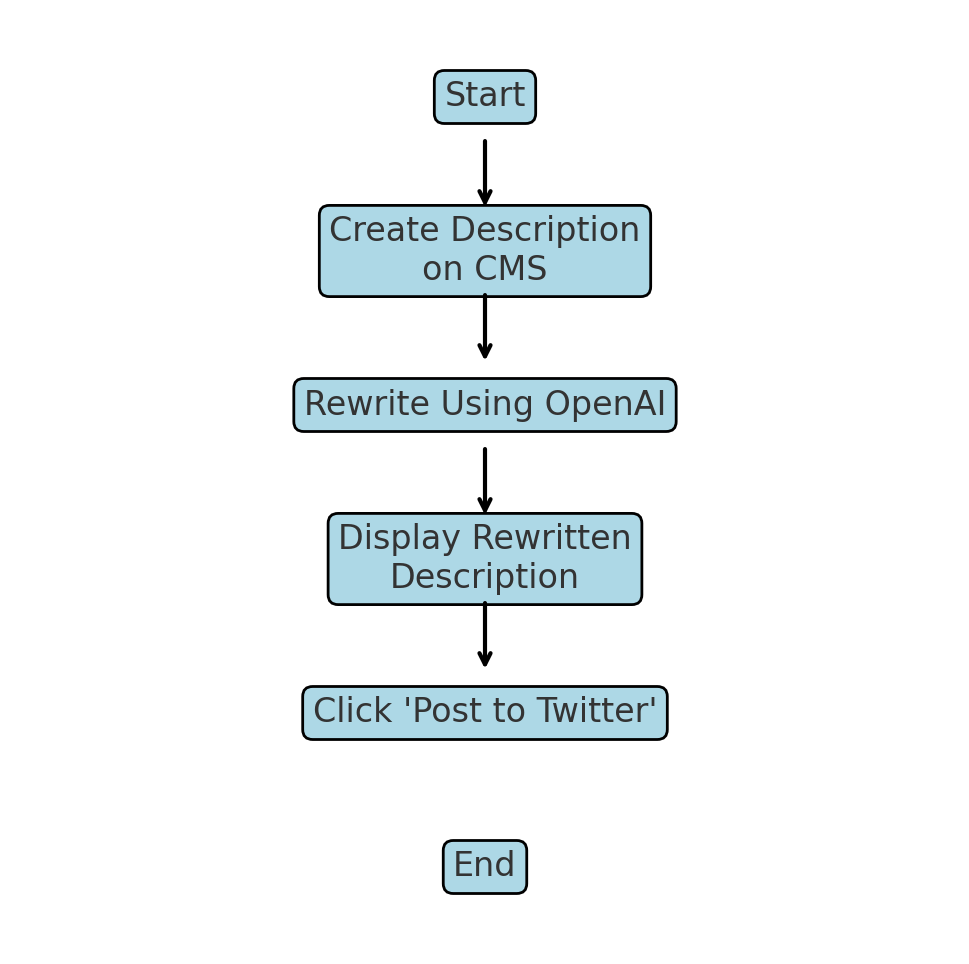
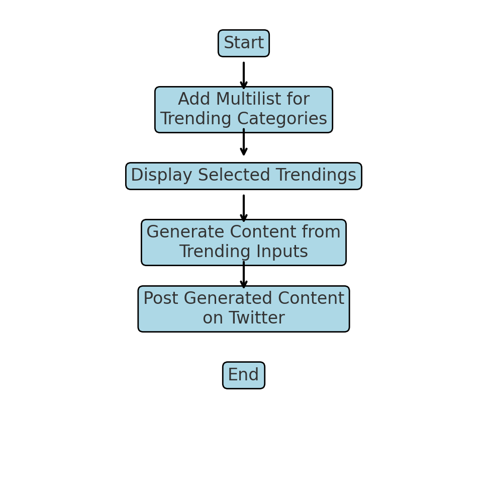

# Sitecore Hackathon 2025

- MUST READ: **[Submission requirements](SUBMISSION_REQUIREMENTS.md)**
- [Entry form template](ENTRYFORM.md)
  
## Team name

Team 48 - Weekend Warriors

## Category

Sitecore XP - Usage of Open AI sync with twitter

## Description

**AI Social sync** is an innovative Sitecore module that leverages artificial intelligence to dynamically generate engaging content for Twitter. By integrating OpenAI's advanced language models, this module enables marketers, content creators, and businesses to easily create relevant, timely, and high-quality posts directly from the Sitecore CMS. 

There are two scenarios in consideration.

**1.** Content regeneration of simpler text.
**2.** Content generation based on selected trendings.

### 1. Content regeneration of simpler text

### 2. Content generation based on selected trendings

You can get detail steps from the attached document.
![Document] (docs/document/Document.pdf)
